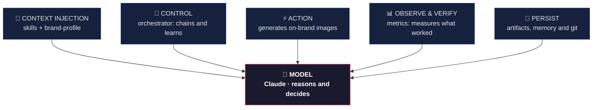
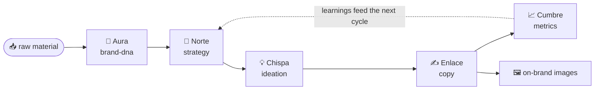

# 🎨 Musa

### A content factory with your brand's voice

*From the little you have to a system that creates, learns, and keeps your voice.*

 

[🇪🇸 Español](README.md) · **🇺🇸 English**

---

> A system that takes the little a brand already has —a half-finished guide, a few loose
> notes— and turns it into a **complete identity** and **channel-ready content**, without
> losing its voice. Not just another tool: it's **agent engineering** applied to marketing.

## The problem

Small businesses and marketing teams don't have an ideas problem. They have a
**consistency** problem:

- They post whenever they remember to.
- They run out of ideas within three days.
- Every piece looks like it belongs to a different brand.

The result: an account that appears and disappears, and a voice that's never quite
recognizable.

## What Musa is

Musa takes a brand's **minimum input** (a half-baked guide, notes, a few old posts, a
logo) and returns a **complete content system**: identity, per-channel strategy, final
copy, and on-brand images — all consistent, in that brand's voice, in a cycle that learns.

## It's not prompting. It's Harness Engineering.

The difference between a toy and a reliable system is the **harness** around the model.
The model reasons and decides; the harness makes it **specialized, reliable, and
repeatable**.

> **Agent = Model + Harness.** The model alone comes out different every time. Model +
> harness comes out the same every time.

| Harness component | In Musa |
|---|---|
| **Context injection** | The skills + the `brand-profile` (the branding method and the brand's voice, injected) |
| **Control** | The **orchestrator**: chains the agents and re-injects what was learned |
| **Action** | The connector that generates on-brand images |
| **Observe & Verify** | The **metrics**: they measure what worked |
| **Persist** | Artifacts + memory + git: nothing is lost, everything inherits |
| **Model** | Claude — reasons and decides |

## The agents

Each agent does **one thing**, and does it well. They all read from a **single source of
truth** (`brand-profile`): that's why the voice never fragments.

| Agent | Role | What it does |
|---|---|---|
| 🧬 **Aura** | `brand-dna` | Distills raw material into the identity: voice, audience, pillars |
| 🎯 **Norte** | `strategy` | Defines what to publish, on which channel, at what cadence |
| 💡 **Chispa** | `ideation` | Turns the plan into concrete ideas |
| ✍️ **Enlace** | `copy` | Writes the final text and the image prompt for each piece |
| 📈 **Cumbre** | `metrics` | Translates performance into decisions |

## The orchestrator — the cycle that learns

The orchestrator runs the agents in the right order, passes each one's output as the
next one's input, and **injects what was learned in the previous cycle**. That's the
harness's *control loop*: it doesn't generate once, it **improves every cycle**.

## Brand-swappable — the proof

The same system, with brands at opposite extremes, keeping the unity:

| | 🌿 **Raíz Viva** | ⚡ **WOX** |
|---|---|---|
| Industry | Artisanal cosmetics | AI-agent consultancy |
| Voice | Warm, editorial | Tech, direct |
| Aesthetic | Photos of hands and process, earth palette | Dark poster with glow, carousel |

Each with **its own** voice and aesthetic, never blending. Proof that it works for any
brand — including yours.

## How it's adopted

**Advisory with system handoff.** Guidance to implement and refine it with your team:

- **Your team** provides the material it already has.
- **Musa** builds the identity, calendar, copy, and images.
- **Your team** reviews, adjusts, and publishes.

> The machine produces. Your team directs.

Governance and best practices aligned with **ISO/IEC 42001** (AI management) from day one.

## 🎥 The pitch

- **Demo video:** [youtu.be/udLEkn3-GCc](https://youtu.be/udLEkn3-GCc)
- Demo Day presentation (Ruta N + Smart Talent, challenge R4 · Content factory with brand voice).

## 👤 About the author

**Jennifer Salazar Duke** — the research and branding methodology behind Musa are her own.
See [`profile.md`](profile.md).

## 📚 Technical documentation

- [Architecture — Harness Engineering](docs/arquitectura.en.md) · how the harness is designed
- [The agents and the orchestrator](docs/agentes.en.md) · each agent's contract

## 📄 What's open and what's proprietary

This repository documents Musa's **architecture and approach**, for learning and technical
transparency. The **branding frameworks** and the **detailed implementation** (each agent's
prompts, the brand-distillation method) are **proprietary** and delivered through advisory.

In one line: the **pattern** is open; the **method** is the author's. You can replicate the
skeleton — the internal judgment is what you hire.

📜 Documentation under **CC BY-NC-SA 4.0** — see [`LICENSE`](LICENSE).

---

## 🤝 Let's talk

Musa is ready for your brand. If your company wants to adopt it or take it to production,
the conversation is directly with the author.

**Jennifer Salazar Duke** · Medellín, Colombia
