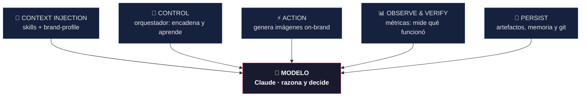
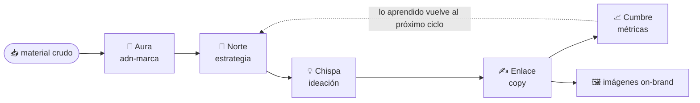
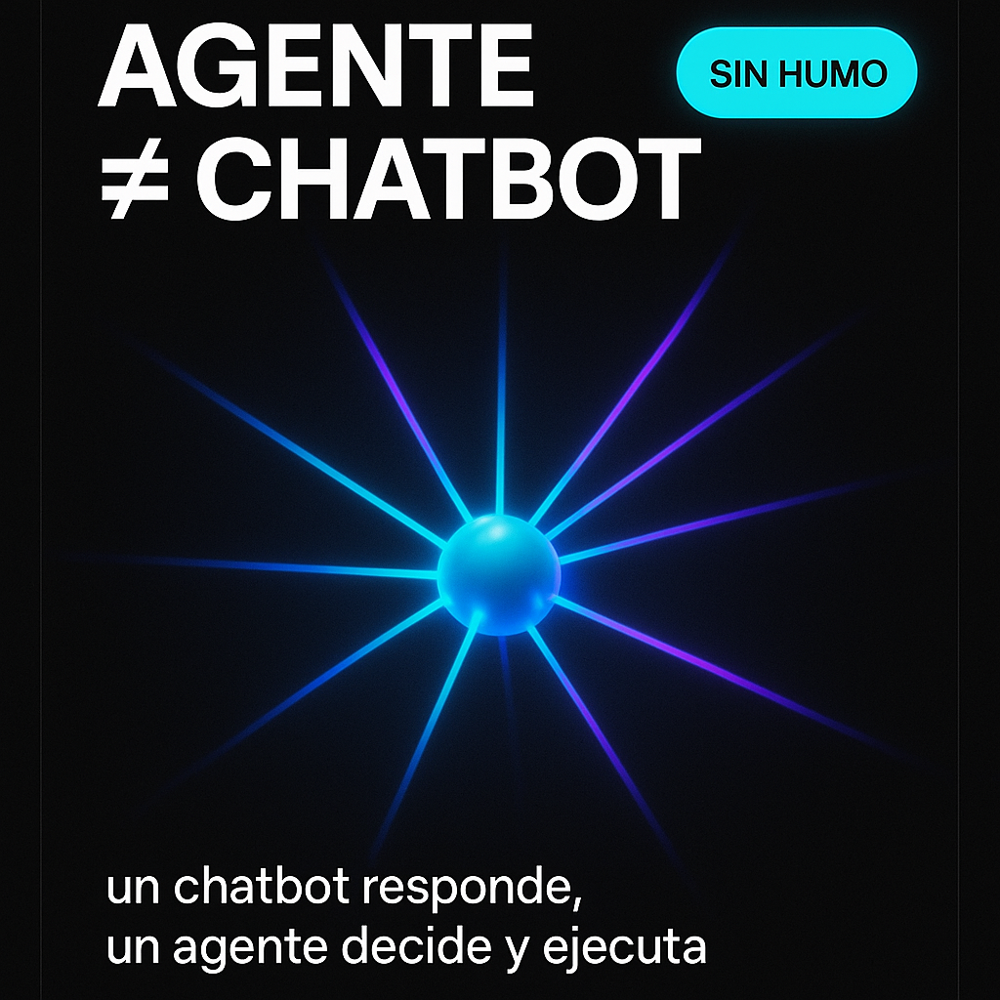
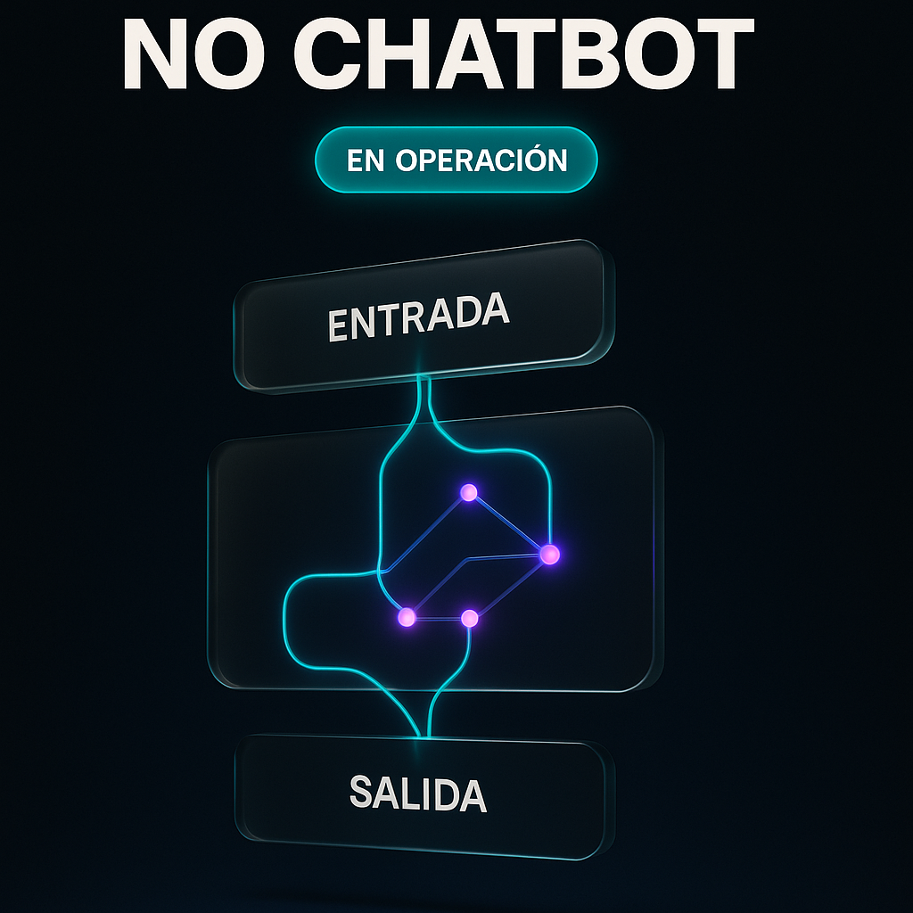
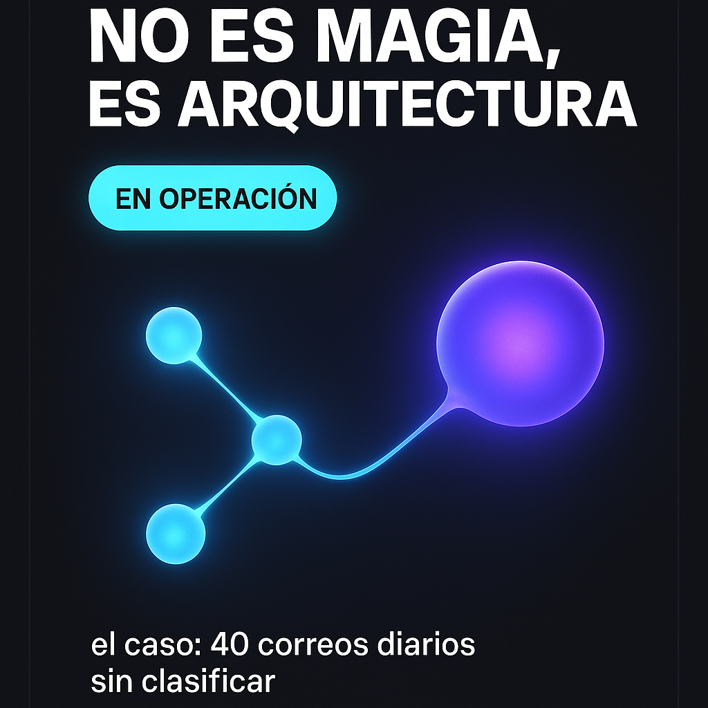

# 🎨 Musa

### Fábrica de contenido con voz de marca

*De lo poco que tenés a un sistema que crea, aprende y no pierde tu voz.*

 

**🇪🇸 Español** · [🇺🇸 English](README.en.md)

---

> Un sistema que toma lo poco que una marca tiene —un manual a medias, unas notas
> sueltas— y lo convierte en **identidad completa** y **contenido listo por canal**,
> sin perder su voz. No es una herramienta más: es **ingeniería de agentes** al
> servicio del marketing.

## El problema

Las pymes y las áreas de marketing no tienen un problema de ideas. Tienen un problema
de **consistencia**:

- Publican cuando se acuerdan.
- Se les acaban las ideas a los tres días.
- Cada pieza parece de otra marca.

El resultado: una cuenta que aparece y desaparece, y una voz que nunca se termina de
reconocer.

## Qué es Musa

Musa toma el **insumo mínimo** de una marca (un manual a medio hacer, notas, unos posts
viejos, un logo) y devuelve un **sistema de contenido completo**: identidad, estrategia
por canal, copy final e imágenes on-brand — todo coherente, con la voz de esa marca, en
un ciclo que aprende.

## No es prompting. Es Harness Engineering.

La diferencia entre un juguete y un sistema confiable es el **arnés** (*harness*) que
rodea al modelo. El modelo razona y decide; el arnés lo hace **especializado, confiable
y repetible**.

> **Agente = Modelo + Arnés.** Solo el modelo sale distinto cada vez. Modelo + arnés
> sale igual siempre.

| Componente del arnés | En Musa |
|---|---|
| **Context injection** | Los skills + el `brand-profile` (el método de branding y la voz de la marca, inyectados) |
| **Control** | El **orquestador**: encadena los agentes y reinyecta lo aprendido |
| **Action** | El conector que genera las imágenes on-brand |
| **Observe & Verify** | Las **métricas**: miden qué funcionó |
| **Persist** | Artefactos + memoria + git: nada se pierde, todo hereda |
| **Modelo** | Claude — razona y decide |

## Los agentes

Cada agente hace **una cosa**, y la hace bien. Todos leen de una **única fuente de
verdad** (`brand-profile`): por eso la voz nunca se fragmenta.

| Agente | Rol | Qué hace |
|---|---|---|
| 🧬 **Aura** | `adn-marca` | Destila el material crudo en la identidad: voz, público, pilares |
| 🎯 **Norte** | `estrategia` | Define qué publicar, en qué canal y con qué ritmo |
| 💡 **Chispa** | `ideación` | Convierte el plan en ideas concretas |
| ✍️ **Enlace** | `copy` | Escribe el texto final y el prompt de cada imagen |
| 📈 **Cumbre** | `métricas` | Traduce el desempeño en decisiones |

## El orquestador — el ciclo que aprende

El orquestador corre los agentes en el orden correcto, pasa el resultado de uno como
input del siguiente, e **inyecta lo aprendido del ciclo anterior**. Ese es el *control
loop* del arnés: no genera una vez, **mejora cada ciclo**.

## Brand-swappable — la prueba

El mismo sistema, con marcas en extremos opuestos, manteniendo la unidad:

| | 🌿 **Raíz Viva** | ⚡ **WOX** |
|---|---|---|
| Rubro | Cosmética artesanal | Consultoría de agentes de IA |
| Voz | Cálida, editorial | Tech, directa |
| Estética | Foto de manos y proceso, paleta de tierra | Póster oscuro con glow, carrusel |

Cada una con **su** voz y **su** estética, sin mezclarse. Prueba de que sirve para
cualquier marca — incluida la tuya.

**🌿 Raíz Viva** — cálida, editorial, fotografía de manos y proceso:

<table>
<tr>
<td width="33%"></td>
<td width="33%"></td>
<td width="33%"></td>
</tr>
</table>

**⚡ WOX** — tech, póster oscuro con glow y carrusel:

<table>
<tr>
<td width="33%"></td>
<td width="33%"></td>
<td width="33%"></td>
</tr>
</table>

## Cómo se adopta

**Asesoría con entrega del sistema.** Acompañamiento para implantarlo y refinarlo con tu
equipo:

- **Tu equipo** entrega el material que ya tiene.
- **Musa** arma la identidad, el calendario, el copy y las imágenes.
- **Tu equipo** revisa, ajusta y publica.

> La máquina produce. Tu equipo dirige.

Gobernanza y buenas prácticas alineadas a **ISO/IEC 42001** (gestión de IA) desde el
día uno.

## 🎥 El pitch

- **Video demo:** [youtu.be/udLEkn3-GCc](https://youtu.be/udLEkn3-GCc)
- Presentación del Demo Day (Ruta N + Smart Talent, reto R4 · Fábrica de contenido con voz de marca).

## 👤 Sobre la autora

**Jennifer Salazar Duke** — la investigación y la metodología de branding detrás de Musa
son propias. Ver [`profile.md`](profile.md).

## 📚 Documentación técnica

- [Arquitectura — Harness Engineering](docs/arquitectura.md) · cómo está diseñado el arnés
- [Los agentes y el orquestador](docs/agentes.md) · el contrato de cada agente

## 📄 Qué es abierto y qué es propietario

Este repositorio documenta la **arquitectura y el enfoque** de Musa, con fines de
aprendizaje y transparencia técnica. Los **frameworks de branding** y la **implementación
detallada** (los prompts de cada agente, el método de destilación de marca) son
**propietarios** y se entregan mediante asesoría.

En una línea: el **patrón** es abierto; el **método** es de la autora. Podés replicar el
esqueleto — el juicio interno es lo que se contrata.

📜 Documentación bajo **CC BY-NC-SA 4.0** — ver [`LICENSE`](LICENSE).

---

## 🤝 Hablemos

Musa está listo para tu marca. Si tu empresa quiere adoptarlo o llevarlo a producción,
la conversación es directa con la autora.

**Jennifer Salazar Duke** · Medellín, Colombia
