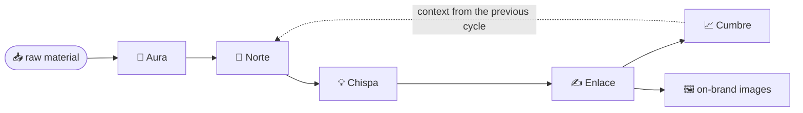

# The agents and the orchestrator

[🇪🇸 Español](agentes.md) · **🇺🇸 English**

> **Scope.** This document describes each agent's **contract** (what it receives, what it
> does, what it delivers) and how the orchestrator chains them. It's the *what*, not the
> *how*: the internal prompts and the branding frameworks each agent applies are
> proprietary and delivered through advisory.

---

## The principle

Each agent fulfills **a single responsibility** and reads from a **single source of truth**
(the `brand-profile`). None of them "knows everything": each does its part and passes the
result to the next. That minimal coupling is what makes the system maintainable, testable,
and reproducible — and what prevents the brand's voice from fragmenting.

## The five agents

| Agent | Receives | Delivers | Single responsibility |
|---|---|---|---|
| 🧬 **Aura** · `brand-dna` | The brand's raw material (guide, notes, posts, logo) | `brand-profile` | Distilling the identity: voice, audience, pillars |
| 🎯 **Norte** · `strategy` | `brand-profile` | Strategy plan | What to publish, on which channel, at what cadence |
| 💡 **Chispa** · `ideation` | Strategy + `brand-profile` | Concrete ideas | Turning the plan into producible pieces |
| ✍️ **Enlace** · `copy` | Ideas + `brand-profile` | Final copy + image prompt | Writing in the brand's voice |
| 📈 **Cumbre** · `metrics` | The cycle's performance | Decisions for the next cycle | Closing the loop with learning |

> **What's reserved:** how Aura *decides* the voice, how Norte *chooses* the mix, by what
> criteria Enlace *writes* — that's the method (the branding frameworks). The contract is
> open; the internal judgment is proprietary.

## The orchestrator — the control loop

The orchestrator doesn't generate content: it **coordinates**. Its job:

1. Runs the agents in the **right order** (each depends on the previous one).
2. Passes **one's output as the next one's input**.
3. When the cycle closes, **re-injects what was learned** (from Cumbre) into the next cycle.

**Cycle 1** starts from the raw material. **Cycle 2** no longer starts from zero: Norte
receives what Cumbre learned. That's why the system doesn't "generate once" — it **improves
every turn**.

## Why single responsibility matters

- **Testable:** each agent is verified on its own.
- **Replaceable:** you improve one agent without touching the rest.
- **Traceable:** each piece can be traced back to the decision that produced it.
- **Consistent:** they all drink from the same source, so nothing contradicts.

> The design is simple on purpose. The sophistication isn't in the architecture —
> it's in the **method** each agent runs.
