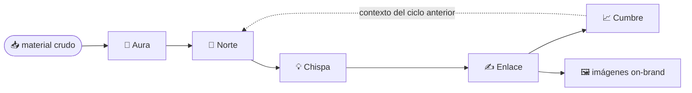

# Los agentes y el orquestador

**🇪🇸 Español** · [🇺🇸 English](agentes.en.md)

> **Alcance.** Este documento describe el **contrato** de cada agente (qué recibe, qué
> hace, qué entrega) y cómo el orquestador los encadena. Es el *qué*, no el *cómo*: los
> prompts internos y los frameworks de branding que cada agente aplica son propietarios y
> se entregan con la asesoría.

---

## El principio

Cada agente cumple **una sola responsabilidad** y lee de una **única fuente de verdad**
(el `brand-profile`). Ninguno "sabe de todo": cada uno hace su parte y pasa el resultado
al siguiente. Ese acoplamiento mínimo es lo que hace el sistema mantenible, testeable y
reproducible — y lo que evita que la voz de la marca se fragmente.

## Los cinco agentes

| Agente | Recibe | Entrega | Responsabilidad única |
|---|---|---|---|
| 🧬 **Aura** · `adn-marca` | Material crudo de la marca (manual, notas, posts, logo) | `brand-profile` | Destilar la identidad: voz, público, pilares |
| 🎯 **Norte** · `estrategia` | `brand-profile` | Plan de estrategia | Qué publicar, en qué canal, con qué ritmo |
| 💡 **Chispa** · `ideación` | Estrategia + `brand-profile` | Ideas concretas | Traducir el plan en piezas producibles |
| ✍️ **Enlace** · `copy` | Ideas + `brand-profile` | Copy final + prompt de imagen | Redactar en la voz de la marca |
| 📈 **Cumbre** · `métricas` | Desempeño del ciclo | Decisiones para el próximo ciclo | Cerrar el lazo con aprendizaje |

> **Lo que se reserva:** cómo Aura *decide* la voz, cómo Norte *elige* el mix, con qué
> criterios Enlace *escribe* — eso es el método (los frameworks de branding). El contrato
> es abierto; el juicio interno, propietario.

## El orquestador — el control loop

El orquestador no genera contenido: **coordina**. Su trabajo:

1. Corre los agentes en el **orden correcto** (cada uno depende del anterior).
2. Pasa la **salida de uno como entrada del siguiente**.
3. Al cerrar el ciclo, **reinyecta lo aprendido** (de Cumbre) en el ciclo siguiente.

**Ciclo 1** parte del material crudo. **Ciclo 2** ya no arranca de cero: Norte recibe lo
que Cumbre aprendió. Por eso el sistema no "genera una vez" — **mejora cada vuelta**.

## Por qué la responsabilidad única importa

- **Testeable:** cada agente se verifica por separado.
- **Reemplazable:** se mejora un agente sin tocar el resto.
- **Trazable:** cada pieza se puede rastrear hasta la decisión que la originó.
- **Coherente:** todos beben de la misma fuente, así que nada se contradice.

> El diseño es simple a propósito. La sofisticación no está en la arquitectura —
> está en el **método** que cada agente ejecuta.
