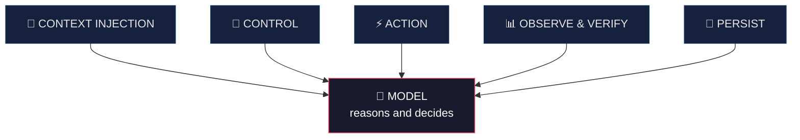

# Architecture — Harness Engineering in Musa

[🇪🇸 Español](arquitectura.md) · **🇺🇸 English**

> **Scope of this document.** It explains Musa's **architectural pattern** for educational
> purposes and technical transparency. The **proprietary content** —the branding frameworks
> and each agent's internal prompts— is not documented here: that is the method delivered
> through advisory. What follows teaches *how the system is designed*, not *how to think
> about a brand* (that is the author's research).

---

## 1. The idea: an agent is not a model

A language model, on its own, is powerful but **inconsistent**: it comes out different
every time. What turns it into a reliable product is the **harness** around it.

> **Agent = Model + Harness.**

The harness doesn't make the model smarter. It makes it **specialized, repeatable, and
verifiable**. That's the difference between "I asked an AI for something" and "I have a
system".

## 2. The five components of the harness

### 2.1 Context Injection — *what the model knows*
The model doesn't guess the brand: it receives structured context. In Musa that's the
**skills** (the method) and the **`brand-profile`** (the distilled identity of that brand).
The key pattern: **a single source of truth**. Everything else inherits from it, and that's
why the voice never fragments across pieces.

*Reserved: the content of the frameworks that structure that context.*

### 2.2 Control — *in what order and with what memory*
The **orchestrator** decides which agent runs, in what order, and with what information from
the previous cycle. It is the *control loop*: it turns a series of loose steps into a
**cycle that learns** (see [`agents.md`](agentes.en.md)).

### 2.3 Action — *how it touches the world*
The system doesn't just "talk": it executes. In Musa, the image connector takes each
piece's prompt and produces the on-brand visual file. Bounded actions, with verifiable
output.

### 2.4 Observe & Verify — *how it knows if it worked*
The **metrics** close the loop: they measure performance and translate it into decisions
for the next cycle. Without verification, an agent is a blind generator; with it, it's a
system that improves.

### 2.5 Persist — *what survives*
Nothing lives only in volatile memory. The `brand-profile`, the artifacts, the learning
memory, and the history (git) **persist**. Each run starts from a known state, not from
zero. That's what makes the system **reproducible**.

## 3. Why this design matters

| Property | Where it comes from |
|---|---|
| **Consistency** | Single source of truth (Context) + Persist |
| **Continuous improvement** | Control loop + Verify |
| **Reproducibility** | Persist + single-responsibility agents |
| **Reliability** | The full harness: the model doesn't improvise, it follows the system |

## 4. What's open and what's reserved

- **Open (this repo):** the pattern, the components, the flow, the reasoning behind the
  design. Useful for learning Harness Engineering applied to a real case.
- **Reserved (advisory):** the branding frameworks, each agent's prompts, the decision
  criteria. That's the know-how that makes the quality difference.

> You can replicate the **skeleton**. The **method** is the author's research — and it's
> what you hire.
