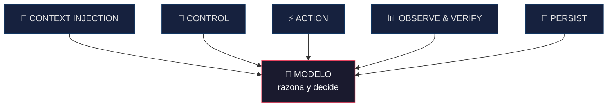

# Arquitectura — Harness Engineering en Musa

**🇪🇸 Español** · [🇺🇸 English](arquitectura.en.md)

> **Alcance de este documento.** Explica el **patrón arquitectónico** de Musa con fines
> educativos y de transparencia técnica. El **contenido propietario** —los frameworks de
> branding y los prompts internos de cada agente— no se documenta aquí: es el método que
> se entrega con la asesoría. Lo que sigue enseña *cómo está diseñado el sistema*, no
> *cómo pensar la marca* (eso es la investigación de la autora).

---

## 1. La idea: un agente no es un modelo

Un modelo de lenguaje, solo, es potente pero **inconsistente**: sale distinto cada vez.
Lo que lo convierte en un producto confiable es el **arnés** (*harness*) que lo rodea.

> **Agente = Modelo + Arnés.**

El arnés no hace al modelo más inteligente. Lo hace **especializado, repetible y
verificable**. Esa es la diferencia entre "le pedí algo a una IA" y "tengo un sistema".

## 2. Los cinco componentes del arnés

### 2.1 Context Injection — *qué sabe el modelo*
El modelo no adivina la marca: recibe contexto estructurado. En Musa eso son los **skills**
(el método) y el **`brand-profile`** (la identidad destilada de esa marca). El patrón
clave: **una única fuente de verdad**. Todo lo demás hereda de ella, y por eso la voz
nunca se fragmenta entre piezas.

*Lo que se reserva: el contenido de los frameworks que estructuran ese contexto.*

### 2.2 Control — *en qué orden y con qué memoria*
El **orquestador** decide qué agente corre, en qué orden, y con qué información del ciclo
anterior. Es el *control loop*: convierte una serie de pasos sueltos en un **ciclo que
aprende** (ver [`agentes.md`](agentes.md)).

### 2.3 Action — *cómo toca el mundo*
El sistema no solo "habla": ejecuta. En Musa, el conector de imágenes toma el prompt de
cada pieza y produce el archivo visual on-brand. Acciones acotadas, con salida verificable.

### 2.4 Observe & Verify — *cómo sabe si funcionó*
Las **métricas** cierran el lazo: miden el desempeño y lo traducen en decisiones para el
próximo ciclo. Sin verificación, un agente es un generador ciego; con ella, es un sistema
que mejora.

### 2.5 Persist — *qué sobrevive*
Nada vive solo en memoria volátil. El `brand-profile`, los artefactos, la memoria de
aprendizaje y el historial (git) **persisten**. Cada corrida parte de un estado conocido,
no de cero. Eso es lo que hace el sistema **reproducible**.

## 3. Por qué este diseño importa

| Propiedad | De dónde sale |
|---|---|
| **Consistencia** | Fuente única de verdad (Context) + Persist |
| **Mejora continua** | Control loop + Verify |
| **Reproducibilidad** | Persist + agentes de responsabilidad única |
| **Confiabilidad** | El arnés completo: el modelo no improvisa, sigue el sistema |

## 4. Lo abierto y lo reservado

- **Abierto (este repo):** el patrón, los componentes, el flujo, el porqué del diseño.
  Sirve para aprender Harness Engineering aplicado a un caso real.
- **Reservado (asesoría):** los frameworks de branding, los prompts de cada agente, los
  criterios de decisión. Ese es el know-how que hace la diferencia de calidad.

> Podés replicar el **esqueleto**. El **método** es la investigación de la autora — y es
> lo que se contrata.
